# The Galaxy Blast Reporting tool for NCBI Blast+ Search Results

Produced by [@Public-Health-Bioinformatics](https://github.com/Public-Health-Bioinformatics)

The Blast Reporting (`blast_reporting.py`) command-line app and Galaxy tool tool generates HTML and tab-delimited tabular reports based on the XML format results of an NCBI Blast+ (`blastn` / `blastp` / `tblastn` etc.) search.

- The tool allows almost complete control over which fields are displayed, how columns are named, and how the HTML report on each query is sectioned.
- Search result records can be filtered out based on values in numeric or textual fields.
- Matches (by accession id) to a selection of reference databases can be shown, and this can include a description of the matched sequence.

Currently this tool only takes as input the "Output format: BLAST XML" option of the NCBI Blast+ search tool, triggered by (for example)

```
blastn -outfmt 5 -query "...."
```

...or via Galaxy by selecting the NCBI Blast+ search tool's option as shown below:

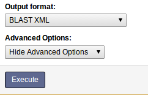

Example of the HTML data report:

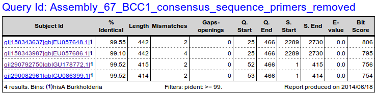

Example of the tabular data report:

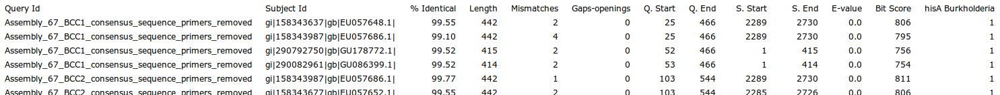

## Usage in Galaxy

The tool's form is shown below.  (Note that this custom visual appearance requires an extra installation step in the Installation section below).

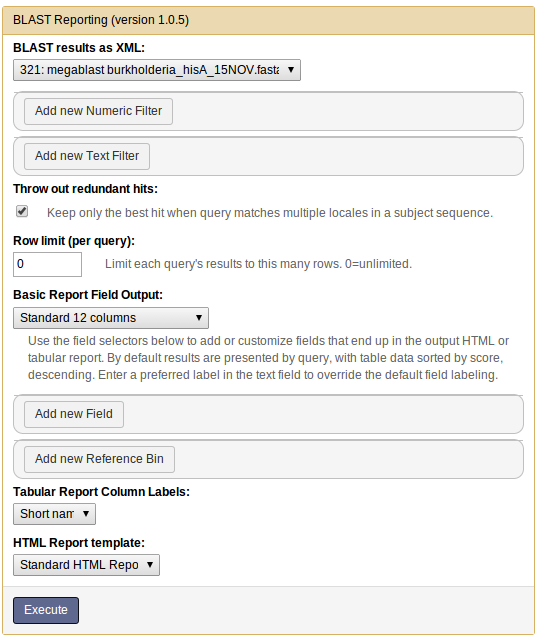

## Inputs

- **BLAST results as XML**: This list only shows files of galaxy type "blastxml". if your Blast+ search result file isn't in this list, then you need to go back and select the XML format for the blast search output.

- **Add new Numeric Filter**: Filters out rows by numeric field value conditions. Click here to add one or moreconditions (=, >=,< etc.) to a field to filter out search results. The example below shows a "greater than 97%" filter on the percentage identity (pident) field:

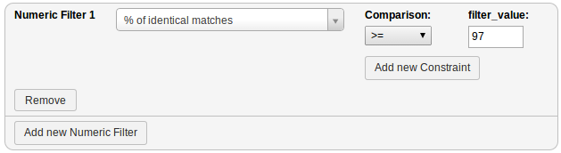

- Add new Text Filter: If you want to accept or reject search result records based on one or more textual terms, put them in a comma-delimited list. Select "excludes text" to reject any records that have one or more of those terms; or "has text" to keep only those that have one or more of the terms.

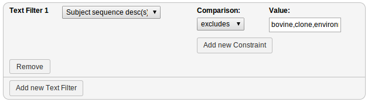

- Throw out redundant hits: If a query matches more than one location in a long sequence, this will only show the hit with the best match. Otherwise each locale hit will be reported on a separate line.

- Row limit (per query): Only the first N results will be shown for a query. 0 = no filtering.

## Basic Report Field Output

This section allows one to select the number of fields to output by selecting from a number of pre-defined formats, and/or by selecting individual fields. By default, results aresorted by Blast+ search score in descending order.

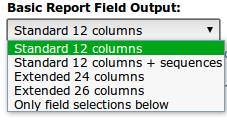

The following fields can be included or added to an existing report format:

| Column | NCBI name    | Description                                  |
|--------|--------------|----------------------------------------------|
| 1      | qseqid       | Query Seq-id (ID of your sequence)           |
| 2      | sseqid       | Subject Seq-id (ID of the database hit)      |
| 3      | pident       | Percentage of identical matches              |
| 4      | length       | Alignment length                             |
| 5      | mismatch     | Number of mismatches                         |
| 6      | gapopen      | Number of gap openings                       |
| 7      | qstart       | Start of alignment in query                  |
| 8      | qend         | End of alignment in query                    |
| 9      | sstart       | Start of alignment in subject (database hit) |
| 10     | send         | End of alignment in subject (database hit)   |
| 11     | evalue       | Expectation value (E-value)                  |
| 12     | bitscore     | Bit score                                    |
| 13     | sallseqid    | All subject Seq-id(s), separated by a ';'    |
| 14     | score        | Raw score                                    |
| 15     | nident       | Number of identical matches                  |
| 16     | positive     | Number of positive-scoring matches           |
| 17     | gaps         | Total number of gaps                         |
| 18     | ppos         | Percentage of positive-scoring matches       |
| 19     | qframe       | Query frame                                  |
| 20     | sframe       | Subject frame                                |
| 21     | qseq         | Aligned part of query sequence               |
| 22     | sseq         | Aligned part of subject sequence             |
| 23     | qlen         | Query sequence length                        |
| 24     | slen         | Subject sequence length                      |
| 25     | pcov         | Percentage coverage                          |
| 26     | sallseqdescr | All subject Seq-descr(s), separated by a ',' |

The "**Add new Field**" function enables one to add a field from the list above to the report. Adding a field that already exists in a 12/24/26 column report allows one to change the label or sorting of that column. Within a query result, added fields can be the primary, secondary, tertiary etc. sort (ascending or descending, or with the "no sort" option which does not affect the overall sort). The field can be included as:

- a column in both tabular and HTML report.
- a hidden column in the HTML report (so it can be used in calculations but not appear). It is not shown on the tabular report either.
- a table section in the HTML report. These table sections are separated by a bold line.
- a report section (within a query result area, each report section gets its own table of data).

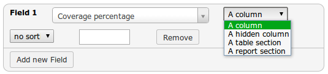

The empty text input field above allows one to change the default label of a column.

In the tabular report, fields marked as table or report sections remain as columns but sorting is still carried out according to those fields' settings.

Note that after running the Galaxy tool version of this command, you can access the "view details" ("i" information icon) link of a job to see the "Job Command-Line:" that was executed. Running this almost verbatim via the command line should generate the same results.

## Reference Bins

Reference bins are basically lists of FASTA sequence accession IDs which the report tries to cross-reference to each query result hit accession Id. This allows one to see if a hit also matches to a curated database one has confidence in. By default a reference bin shows up as two columns - one named as the reference bin, containing a flag indicating whether hit was found there or not, and a second that shows the reference bin sequence's description (deselect this option below if desired). One can have a match to a reference bin force the given hit to be included or excluded from the report as well, using the filtering menu options.

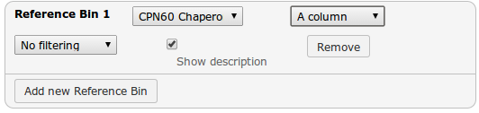

Reference bin hits are also described by adding a superscript (1,2,3..etc) to the 1st column (accession id) of the hit record. At the bottom of the table a legend exists for each referenced bin. Sometimes one may want to just show this bin superscript and legend; in that case, use the column-type selection list (showing "A column" above) to select "A hidden column". 

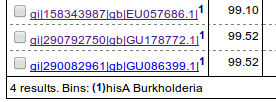

The setup of new reference bins is handled by a Galaxy system administrator.

## Tabular Report Column Names

The tabular report can include column header containing names of the columns as either the xml field's "short name", or a longer "field name" - a plain English name - for each column. Also, any custom field labels will display when this option is selected.

## HTML Report Template

### Standard HTML Report

This template provides a few features like bin legend and Google linking of accession id's, and a Print button which prints each query result out on a separate page.


Note, if a query doesn't generate any hits it will be omitted entirely from the tabular report. The HTML report will highlight this situation at the top as follows:

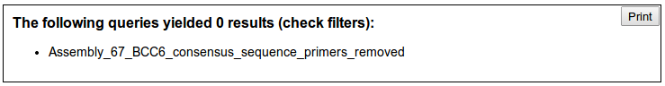

### Custom Report Templates

Other customized HTML report templates can be installed by galaxy System administrators.

## Command Line Usage

### Simple usage

Usage via Galaxy may involve a few other hidden parameters for HTML report options.

```
blast_reporting.py [blastxml_input_file] [out_format][tabular_output_file] [option: html_output_file] [options]

Options:
 -h, --help Show this help message and exit
 -b REFERENCE_BINS, --bins=REFERENCE_BINS
            Provide a comma-delimited list of reference database
            names to check, along with their sort order e.g.
            "16Sncbi desc,euzby desc,16Srdp exclude". Don't
            include .csv suffix.           These will
            become the primary sort.
 -c CUSTOM_FIELDS, --columns=CUSTOM_FIELDS
            To modify sorting and formatting, specify a comma-
            delimited list of field specifications of the form: "[
            field_name]:[column|table|section]:[asc|desc|none]:[ne
            w label text];..." .
 -f FILTERS, --filter=FILTERS
            Provide a semicolon-delimited list of fields and their
            criteria to filter by.
 -i, --info Provides list of columns and their descriptions, for
            use in filter, sort and custom column lists.
 -l COLUMN_LABELS, --label=COLUMN_LABELS
            Include field labels in first row of tab-delimited
            result table as short names or data field names (or
            none)
 -n ROW_LIMIT, --number=ROW_LIMIT
            Provide a limit to the number of rows of returned
            data. The default 0=unlimited.
 -r, --redundant    Return only first match to a gene bank id result.
 -t TEST_IDS, --tests=TEST_IDS
            Enter "all" or comma-separated id(s) of tests to run.
```

### Details

This tool can be used both via command line and via a local Galaxy install. Galaxy uses `.loc` files (`blast_reporting_fields.loc`, `fasta_reference_dbs.loc`) as indicated by the tool's `tool_data_table_conf.xml.sample`. The command line script uses `.tab` versions (located in the script's folder) which need to reflect any changes made in the `.loc` versions.

`[out_format]` is one of:
- `std` : standard 12 column
- `std+seqs` : standard 12 column plus search and matched sequences
- `ext` : extended 24 column
- `ext+`: 26+ column
- `custom`: Use only given field selections.

Use `-i` to see possible field (column) selections as defined by `blast_reporting_fields.tab`.

**Note**: the selection file option is used mainly by the galaxy blast reporting tool.

`REFERENCE_BINS`: Selected bins have their columns shown in output table for clarity, even when custom fields are selected, unless selecting the bin "exclude" option.

`FILTERS`:

Format: `([field_name]:[comparator] [value];)*`

e.g:

```
pident: gt 97; sallseqdescr: excludes bovine|clone|environmental|swine|uncultivated|uncultured|unidentified
```

`[comparator]` is one of:
- `==` numeric equal
- `!=` numeric not equal
- `gt` numeric greater than
- `lt` numeric less than
- `includes` (search text fields for included words/phrases)
- `excludes` (same as above but exclude result if text found)

Textual comparisons may have a value consisting of phrases to search for separated by `|` (disjunction).

### Example

This will return a standard 12 field report as `report.tab` tabular data and `report.html` html report, with a filter on the `pident` field of greater than or equal to `99.5`, and with a reference bin of `hisA_burkholderia`, and a maximum of `6` hits per query.

```
blast_reporting.py [path to blast xml search result report] std report.tab report.html -f "pident: gte 99.5;" -b hisA_burkholderia -n 6
```

## Installation

### Using Reference Bins

A reference bin file is simply a text file having line records each containing a Genebank sequence accession id and title/description. The accession id is cross-referenced with the accession id returned with each search hit.  We have to tell the Blast reporting tool where these tables are. Their names and paths are listed in the tool's `fasta_reference_dbs.loc.sample`, which ends up in the Galaxy install's `tool-data/fasta_reference_dbs.loc` file which you can edit.  By default no reference bins are included.

Example bin file content:

```
AADS00000000.1 Phanerochaete chrysosporium RP-78
AAEW02000014.2 Desulfuromonas acetoxidans DSM 684
AAEY01000007.0 Cryptococcus neoformans var. neoformans B-3501A
AAFI01000166 Dictyostelium discoideum AX4
AAFW02000169.3 Saccharomyces cerevisiae YJM789
```
Both the search result hit and the reference file accession ids are stripped of any fractional component before being compared.

### Using the Selectable HTML Report

- This is EXPERIMENTAL because it currently requires the "select_subsets" galaxy tool with a bit of extra setup that might have to be redone as Galaxy evolves:
- In Galaxy install and run the "Select subsets" tool from [https://toolshed.g2.bx.psu.edu/](https://toolshed.g2.bx.psu.edu/).
- Use your browser's "View frame source" option while mouse is over the Select Subsets tool form.
- Scroll down to the and copy the numeric value string into a new text file.
- Save the text file with the name `html_selectable_report_tool_state` to the tool's `templates/` subfolder. It should be alongside the `html_selectable_report.py` script which reads it.

### Custom CSS Styling

The visual appearance of the Blast Reporting tool defaults to the standard Galaxy tool form look.  It can be customized using the tool's `panel_layout.css` file contents are appended to the site's `static/style/blue/library.css` file.  Currently this may have to be done after each Galaxy upgrade.
